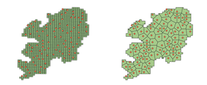

# Distributing internal economic level of districts using satellite imagery and power-laws for cities (KCC 2022)

Pytorch Implementation of Distributing internal economic level of districts using satellite imagery and power-laws for cities



  * Our model consists of 3 parts, which are introduced below.
  * Step 1. We measure the hyperlocal economic scores of each grids by inferring the relative degree of individual grid image's economic development via ordinal regression.
  * Step 2. We get the core points of the districts using gradient descent, and make Voronoi cells using the points.
  * Step 3. After choosing appropriate distribution for the district, we distribute the economic statistics using the distribution. For alpha in the distribution formula, we pre-calculated the average alpha values of districts by using the existing ground-truth data.

### Step 1. Measuring hyperlocal score
<hr/>

Calculating hyperlocal scores using ordinal regression model
```
usage: 1-Calculating hyperlocal scores.py [-h] [--model MODEL] [--thr1 THR1] [--thr2 THR2]
                                          [--path PATH] [--csv_name CSV]
```  
  
  

**Measuring hyperlocal score Example**
```
python3 1-Calculating hyperlocal scores.py --model ./model/proxy_ordinal.ckpt --csv_name zl15_32645_score_AAXXYY.csv
```

### Step 2-A. Extracting Core points
<hr/>

Extracting core points of districts using gradient descent
```
usage: 2-voronoi_core_shell.py
```  
Basically, running the above code will do all the works for you by surfing all the major/minor districts in Korea(under the assumption you have preliminary files. For preliminary files, check the code for detailed understandings). But in case you want to extract core points of a single district, you can use the below code for that.

Extracting core points of **single** district
```
usage: 2-(sub)-extract_core.py [-h] [--zl ZOOM LEVEL] [--adm1 PROVINCE] [--adm2 CITY]
                                          [--dir PATH FOR OUTPUT] 
```  


**Extracting core points Example**
```
python3 2-(sub)-extract_core.py --zl 15 --adm1 Chungbuk --adm2 Chungju-si --dir voronoi_result/
```


### Step 2-B. Performing Voronoi split
<hr/>

### Step 3. Distributing economic statistics to sub-regions
<hr/>
